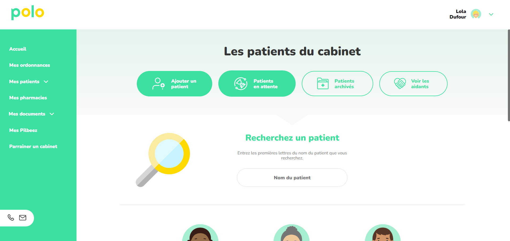

<h3 align="center">ICE Test</h3>

  

    A one-page test project to do from an already made mock-up.
     
    Only front-end, responsive.
     
     
    <a href="https://cecilia-pocket.github.io/ICE-TEST/">View Demo</a>
  

<!-- TABLE OF CONTENTS -->

  
Table of Contents

  <ol>
    <li>
      <a href="#about-the-project">About The Project</a>
      <ul>
        <li><a href="#built-with">Built With</a></li>
      </ul>
    </li>
    <li><a href="#contact">Contact</a></li>
    <li><a href="#resources">Resources</a></li>
  </ol>

<!-- ABOUT THE PROJECT -->
## About The Project

### Built With

* HTML5, CSS3
* Javascript
* Visual Studio Code

<!-- CONTACT -->
## Contact

Cécilia Nguyen - ngcecilia@orange.fr

Project Link: [https://github.com/cecilia-pocket/ICE-TEST](https://github.com/cecilia-pocket/ICE-TEST)

<!-- RESOURCES -->
## Resources

* [Mock-up from Ice Dev](https://www.figma.com/file/VbPu5A3iLG2RUEoJgmI3bW/Test-Decoupe?node-id=163%3A1073)
* [JS nav collapse and expand from CSS Tricks](https://css-tricks.com/using-css-transitions-auto-dimensions/)
* [JS sliding menu for mobile version from Yago Estévez](https://codepen.io/yagoestevez/pen/rqamJb)

(<a href="#top">back to top</a>)

